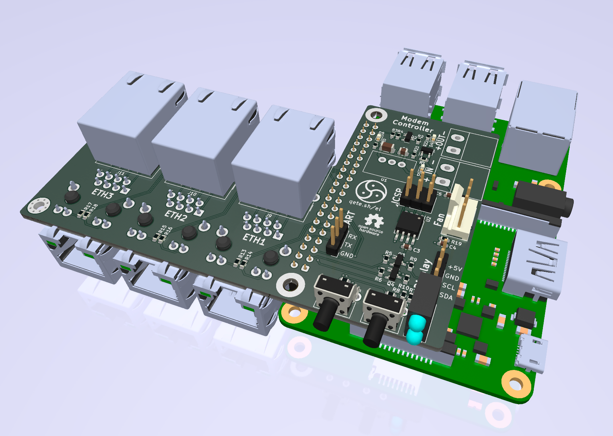

# Hardware Parts
### PCB
The KiCad Files for the board that connects the Raspberry Pi to the rest of the hardware

### STL-Files
The front- and backpanels I created to mount the hardware into a 19" "Splice Box" case